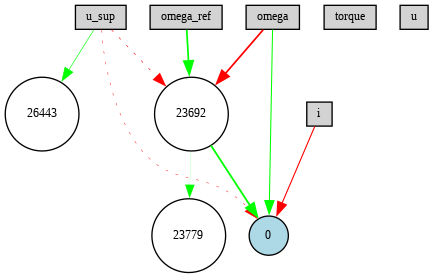

# Controller Design Revisited NEATly: Neuroevolution-Based Control of Electric Motors in Multi-Objective Settings

## Abstract

PID controllers and their extensions dominate the control systems of today, due to their simple design and mathematical motivation. The success of PID controllers is based on the linearization of physical systems and a one-dimensional objective, namely controlling for maximum precision. However, highly dynamical reference functions render a linearization of the physical system difficult, and modern control tasks often seek to not only control precisely but also demand secondary control objectives like efficiency, safety, or component sustainability. These boundary conditions construct a high-dimensional optimization space for which finding an optimal solution mathematically becomes infeasible.

This work examines neuro-evolutionary algorithms as a potential alternative to solve these high-dimensional, often non-linear optimization problems. The approach is applied to the control task of an electric motor and compared to manually designed PID controllers and PID controllers whose parameters are tuned with an evolutionary algorithm.

## Key Contributions

- **Novel Application of NEAT**: Demonstrated the applicability of NeuroEvolution of Augmenting Topologies (NEAT) to real-time controller design for electric motors, representing the first known application of NEAT in this domain.
- **Multi-Objective Optimization**: Successfully explored the trade-off between controller precision and energy efficiency using reward-weighted NEAT optimization.
- **Framework Extensions**: Extended the Gym Electric Motor (GEM) framework to include:
  - A general training-validation-guidance scheme for controller benchmarking.
  - Visual and statistical performance evaluation tools.
  - Config-driven experiment orchestration for improved reproducibility.
- **Comparative Study**: Provided an empirical comparison of three controller design paradigms: classical PID, EA-tuned PID, and NEAT-based control.

## Methodology

The methodology consists of three main components:

### 1. Controller Design via NEAT  
The neural network representing the controller is evolved both in structure and weight using NEAT. The network is evaluated via interaction with electric motor simulations, where performance is assessed by a multi-objective reward function.

### 2. Extended Framework Architecture  
A training, validation, and guidance pipeline is implemented to support:
- Evolution-based and RL-based agents.
- Step-based analysis and episode recording.
- Reward shaping using custom reward finalizers like NiLogLU.

  
*Figure 1: Training, validation and guidance scheme. The user
 supplies an entity and the environments for each type of
 iteration. The given entity then undergoes the shown three-step
 process repeatedly not only to be trained but also to allow the
 user to access performance indicators during training and get
 full visualisations of the entities behavior.*

### 3. Multi-Objective Reward Function  
A composite reward function is constructed using two terms:
- **Precision**: L2-distance between target and actual velocity.
- **Energy Efficiency**: Minimized electrical energy input per step.

  
*Figure 2: Normalized inverse Logarithmified Linear Unit
 (NiLogLU) for parameters k = 4, a = 0, b = 10, l = a−ζ =
 0−0.01 and s = 0.1. Note the high gradient when approaching
 the lower bound that compensates for a saturating behavior of
 the distance meassure concerning behavior space.*

Each term is finalized using the NiLogLU function to ensure non-saturating gradients for more stable and interpretable optimization behavior.

## Results

The experiment compared the performance of three controllers:
- A manually designed cascaded PID controller,
- An EA-optimized PID controller,
- A NEAT-generated controller.

Experiments were conducted under four conditions:
1. No load + no energy reward  
2. No load + energy reward  
3. Load + no energy reward  
4. Load + energy reward

### Key Findings:

#### Performance Trade-off  
NEAT-based controllers revealed a tunable trade-off between precision and energy efficiency that classical PID controllers cannot achieve.

  
  
*Figure 3: Experiment results on the training environments seper
ated for each agent type and experiment run. As the classical
 controller is the same for all four experiments, it yields the
 same results with or without a reward for energy efficiency.
 This is indicated by the slight transparency of the corre
sponding bars. The bars show the mean value over all 10
 training environments and the grey error bars indicate the 95%
 confidence interval. (top) Displays the average absolute deviation
 from reference per step and (bottom) summarizes the average input
 energy per step.*

#### Control Behavior Analysis  
NEAT controllers optimized for precision showed highly dynamic, sharp control behavior, while those optimized for energy exhibited smoother, more conservative control actions.

  

  

  
*Figure 4: Control behavior over the first 0.02 seconds of a
 play session on a training environment for (top) a NEAT-agent
 optimized merely for precision, (middle) a NEAT-agent optimized
 jointly for efficiency and (bottom) a classical controller. For each
 agent, the trajectory of the current i, the voltage u and ω
 are shown in blue. The plot for the target variable ω also
 contains the trajectory of the reference value ωref in orange.
 Additionally, each plot contains the physical limits of the
 system as dashed red lines.*

#### Architectural Insights  
NEAT produced structurally interpretable networks that adapted depending on the optimization objective.

 

  
*Figure 5: Network architectures after 1000 training iterations
 of (top) a NEAT-agent optimized merely for presicion and
 (bottom) a NEAT-agent optimized both for precision and energy
 efficiency. The rectangles denote the inputs available to the
 network, white circles are neurons developed by NEAT con
taining a bias and activation function and the blue circle
 represents the output node of the network. The arrows express
 the weights of the network, where the thickness and color
 indicate the magnitude and sign of the corresponding weight
 respectively.*

#### Constraint Violations  
The classical controller showed occasional constraint violations (e.g., overcurrent), while NEAT respected physical limits more reliably when optimized for safety.

  

  
*Figure 6: Number of constraint violations for each agent type
 and experiment run on (top) the training environments and (bottom)
 the validation environments.*

For a comprehensive presentation of results and methodology, please refer to the full [paper PDF](./ControllerDesignRevisitedNEATly.pdf).

## Institutional Affiliation

This research was conducted during my project work at the **Hochschule Karlsruhe – University of Applied Sciences**, under the supervision of:  
- **Prof. Dr. Jan Bauer** (Examiner)

All experiments and framework extensions were carried out independently by the author. The work was graded **1.0** (highest possible in Germany).

---
